# Safe Journeys Platform — Enterprise Architecture

## Vision

A real-time road safety intelligence platform that ingests crash data, weather, traffic,
and road network information from multiple countries to provide:

- Live journey risk scoring and safer route recommendations
- Crash hotspot identification and trend analysis
- Speed limit and infrastructure recommendations for authorities
- Crowdsourced hazard reporting and alerting
- Predictive risk modelling under changing conditions

---

## High-Level System Diagram

```
┌─────────────────────────────────────────────────────────────────────────────┐
│                              CLIENTS                                        │
│  ┌──────────┐  ┌──────────┐  ┌───────────┐  ┌────────────┐  ┌───────────┐ │
│  │ Mobile   │  │ Web App  │  │ Authority │  │ Public API │  │ Waze/OEM  │ │
│  │ App      │  │ (React)  │  │ Dashboard │  │ Partners   │  │ Partners  │ │
│  └────┬─────┘  └────┬─────┘  └─────┬─────┘  └─────┬──────┘  └─────┬─────┘ │
└───────┼──────────────┼──────────────┼──────────────┼───────────────┼────────┘
        │              │              │              │               │
        └──────────────┴──────────────┴──────┬───────┴───────────────┘
                                             │
┌────────────────────────────────────────────┼────────────────────────────────┐
│                         API GATEWAY LAYER  │                                │
│  ┌─────────────────────────────────────────▼──────────────────────────────┐ │
│  │                    AWS API Gateway / Kong                              │ │
│  │         (Rate limiting, Auth, Geo-routing, API versioning)            │ │
│  └─────────────────────────────────────────┬──────────────────────────────┘ │
│  ┌─────────────────────────────────────────▼──────────────────────────────┐ │
│  │              AWS CloudFront / Cloudflare (CDN + WAF + DDoS)           │ │
│  └────────────────────────────────────────────────────────────────────────┘ │
│  ┌────────────────────────────────────────────────────────────────────────┐ │
│  │              Amazon Cognito / Auth0  (AuthN/AuthZ, OAuth2, OIDC)      │ │
│  └────────────────────────────────────────────────────────────────────────┘ │
└────────────────────────────────────────────┬────────────────────────────────┘
                                             │
┌────────────────────────────────────────────┼────────────────────────────────┐
│                     SERVICE MESH (AWS EKS / Kubernetes)                      │
│                     Istio service mesh, Envoy sidecars                       │
│                                            │                                │
│  ┌─────────────────────────────────────────┴───────────────────────────┐    │
│  │                                                                     │    │
│  │  ┌───────────────┐  ┌───────────────┐  ┌────────────────────────┐  │    │
│  │  │ Journey       │  │ Risk Scoring  │  │ Route Optimisation     │  │    │
│  │  │ Service       │  │ Service       │  │ Service                │  │    │
│  │  │               │  │               │  │                        │  │    │
│  │  │ - Plan route  │  │ - Segment     │  │ - OSRM / Valhalla     │  │    │
│  │  │ - Score risk  │  │   risk calc   │  │ - Multi-modal routing  │  │    │
│  │  │ - Alt routes  │  │ - Real-time   │  │ - Avoidance zones      │  │    │
│  │  │ - ETA + risk  │  │   weather adj │  │ - Traffic-aware        │  │    │
│  │  └───────┬───────┘  └───────┬───────┘  └──────────┬─────────────┘  │    │
│  │          │                  │                      │                │    │
│  │  ┌───────┴───────┐  ┌──────┴────────┐  ┌─────────┴──────────────┐ │    │
│  │  │ Hotspot       │  │ Prediction    │  │ Crowdsource            │ │    │
│  │  │ Service       │  │ Service (ML)  │  │ Service                │ │    │
│  │  │               │  │               │  │                        │ │    │
│  │  │ - Cluster     │  │ - XGBoost /   │  │ - Hazard reports       │ │    │
│  │  │   analysis    │  │   LightGBM    │  │ - User validation      │ │    │
│  │  │ - Trend       │  │ - Deep learn  │  │ - Waze CIFS feed       │ │    │
│  │  │   detection   │  │   (temporal)  │  │ - Reputation scoring   │ │    │
│  │  │ - Severity    │  │ - Feature     │  │ - Incident lifecycle   │ │    │
│  │  │   ranking     │  │   store query │  │                        │ │    │
│  │  └───────────────┘  └───────────────┘  └────────────────────────┘ │    │
│  │                                                                     │    │
│  │  ┌───────────────┐  ┌───────────────┐  ┌────────────────────────┐  │    │
│  │  │ Ingestion     │  │ Authority     │  │ Notification           │  │    │
│  │  │ Service       │  │ Service       │  │ Service                │  │    │
│  │  │               │  │               │  │                        │  │    │
│  │  │ - Crash data  │  │ - Speed limit │  │ - Push notifications   │  │    │
│  │  │ - Weather     │  │   recommend.  │  │ - SMS alerts           │  │    │
│  │  │ - Traffic     │  │ - Infra invest│  │ - In-app warnings      │  │    │
│  │  │ - Road network│  │   priorities  │  │ - Webhook delivery     │  │    │
│  │  │ - Shapefiles  │  │ - Reporting   │  │ - Email digests        │  │    │
│  │  └───────────────┘  └───────────────┘  └────────────────────────┘  │    │
│  └─────────────────────────────────────────────────────────────────────┘    │
│                                                                             │
└─────────────────────────────────────────────────────────────────────────────┘

┌─────────────────────────────────────────────────────────────────────────────┐
│                          DATA & ML PLATFORM                                 │
│                                                                             │
│  ┌──────────────────────────────────────────────────────────────────────┐   │
│  │                    EVENT STREAMING (Apache Kafka / Amazon MSK)       │   │
│  │                                                                      │   │
│  │  Topics:                                                             │   │
│  │   crash.raw.{country}     weather.realtime.{region}                  │   │
│  │   traffic.flow.{region}   crowdsource.reports                        │   │
│  │   risk.scores.updated     alerts.outbound                            │   │
│  │   model.predictions       road.network.changes                       │   │
│  └──────────────────────────┬───────────────────────────────────────────┘   │
│                              │                                              │
│  ┌───────────────────────────┼──────────────────────────────────────────┐   │
│  │          STREAM PROCESSING│(Apache Flink / Kafka Streams)            │   │
│  │                           │                                          │   │
│  │  ┌───────────────┐  ┌────┴──────────┐  ┌────────────────────────┐   │   │
│  │  │ Weather       │  │ Risk Score    │  │ Anomaly                │   │   │
│  │  │ Enrichment    │  │ Recalculation │  │ Detection              │   │   │
│  │  │               │  │               │  │                        │   │   │
│  │  │ Join crash +  │  │ Recompute     │  │ Spike detection on     │   │   │
│  │  │ weather on    │  │ segment risk  │  │ crash frequency per    │   │   │
│  │  │ location +    │  │ as conditions │  │ segment, trigger       │   │   │
│  │  │ timestamp     │  │ change        │  │ investigation alerts   │   │   │
│  │  └───────────────┘  └───────────────┘  └────────────────────────┘   │   │
│  └──────────────────────────────────────────────────────────────────────┘   │
│                                                                             │
│  ┌──────────────────────────────────────────────────────────────────────┐   │
│  │                         DATA STORES                                  │   │
│  │                                                                      │   │
│  │  ┌─────────────────────┐  ┌──────────────────────────────────────┐   │   │
│  │  │ PostGIS             │  │ Apache Parquet on S3                 │   │   │
│  │  │ (Amazon Aurora)     │  │ (Data Lake / Lakehouse)              │   │   │
│  │  │                     │  │                                      │   │   │
│  │  │ - Road segments     │  │ - Raw crash history (all countries)  │   │   │
│  │  │ - Live risk scores  │  │ - Weather history                    │   │   │
│  │  │ - Crash records     │  │ - Traffic flow history               │   │   │
│  │  │ - Spatial queries   │  │ - Model training datasets            │   │   │
│  │  │ - User data         │  │ - Queryable via Athena / Trino       │   │   │
│  │  └─────────────────────┘  └──────────────────────────────────────┘   │   │
│  │                                                                      │   │
│  │  ┌─────────────────────┐  ┌──────────────────────────────────────┐   │   │
│  │  │ Redis Cluster       │  │ Elasticsearch / OpenSearch           │   │   │
│  │  │                     │  │                                      │   │   │
│  │  │ - Pre-computed      │  │ - Full-text search on crash records  │   │   │
│  │  │   segment risk      │  │ - Geo-aggregation queries            │   │   │
│  │  │   scores            │  │ - Dashboard analytics                │   │   │
│  │  │ - Session cache     │  │ - Log aggregation                    │   │   │
│  │  │ - Rate limiting     │  │                                      │   │   │
│  │  │   counters          │  │                                      │   │   │
│  │  │ - Route cache       │  │                                      │   │   │
│  │  └─────────────────────┘  └──────────────────────────────────────┘   │   │
│  │                                                                      │   │
│  │  ┌─────────────────────┐                                             │   │
│  │  │ H3 Spatial Index    │  Uber's H3 hexagonal grid used as the      │   │
│  │  │                     │  universal spatial key across all stores.   │   │
│  │  │ - Resolution 9      │  Each hex ~0.1 km² — ideal for road        │   │
│  │  │   (~174m edge)      │  segment-level analysis.                   │   │
│  │  │   for urban         │  Stored as columns in PostGIS, Redis       │   │
│  │  │ - Resolution 7      │  keys, Kafka partition keys, and           │   │
│  │  │   (~1.2km edge)     │  Parquet partition columns.                │   │
│  │  │   for rural         │                                            │   │
│  │  └─────────────────────┘                                             │   │
│  └──────────────────────────────────────────────────────────────────────┘   │
│                                                                             │
│  ┌──────────────────────────────────────────────────────────────────────┐   │
│  │                    ML / AI PLATFORM                                   │   │
│  │                                                                      │   │
│  │  ┌─────────────────────┐  ┌──────────────────────────────────────┐   │   │
│  │  │ Feature Store       │  │ Model Training & Registry            │   │   │
│  │  │ (Feast / SageMaker  │  │ (SageMaker / MLflow)                 │   │   │
│  │  │  Feature Store)     │  │                                      │   │   │
│  │  │                     │  │ Models:                               │   │   │
│  │  │ Online features:    │  │  - Crash severity classifier         │   │   │
│  │  │  - Segment crash    │  │    (LightGBM)                        │   │   │
│  │  │    rate (7d/30d/1y) │  │  - Segment crash probability         │   │   │
│  │  │  - Weather now      │  │    (XGBoost)                         │   │   │
│  │  │  - Traffic flow now │  │  - Weather-crash interaction          │   │   │
│  │  │  - Speed limit      │  │    (Neural net)                      │   │   │
│  │  │  - Road geometry    │  │  - Time-series forecasting            │   │   │
│  │  │  - Day/night        │  │    (Prophet / Temporal Fusion         │   │   │
│  │  │  - Holiday flag     │  │     Transformer)                     │   │   │
│  │  │                     │  │  - NLP for crowdsource reports        │   │   │
│  │  │ Offline features:   │  │    (Claude API / embeddings)         │   │   │
│  │  │  - Historical agg.  │  │                                      │   │   │
│  │  │  - Seasonal patterns│  │ Retraining: weekly batch via          │   │   │
│  │  │  - Trend slopes     │  │  Airflow / Step Functions             │   │   │
│  │  └─────────────────────┘  └──────────────────────────────────────┘   │   │
│  │                                                                      │   │
│  │  ┌─────────────────────┐  ┌──────────────────────────────────────┐   │   │
│  │  │ Model Serving       │  │ Experiment Tracking                  │   │   │
│  │  │ (SageMaker          │  │ (MLflow / W&B)                       │   │   │
│  │  │  Endpoints /        │  │                                      │   │   │
│  │  │  Triton)            │  │ - A/B testing of models              │   │   │
│  │  │                     │  │ - Champion/challenger promotion       │   │   │
│  │  │ - <10ms p99 for     │  │ - Drift detection                    │   │   │
│  │  │   risk scoring      │  │ - Feature importance tracking        │   │   │
│  │  │ - Batch inference   │  │                                      │   │   │
│  │  │   for map updates   │  │                                      │   │   │
│  │  └─────────────────────┘  └──────────────────────────────────────┘   │   │
│  └──────────────────────────────────────────────────────────────────────┘   │
│                                                                             │
└─────────────────────────────────────────────────────────────────────────────┘

┌─────────────────────────────────────────────────────────────────────────────┐
│                     EXTERNAL DATA SOURCES                                   │
│                                                                             │
│  ┌─────────────────┐  ┌─────────────────┐  ┌────────────────────────────┐  │
│  │ Crash Data       │  │ Weather APIs    │  │ Traffic Data               │  │
│  │                  │  │                 │  │                            │  │
│  │ NZ: Waka Kotahi │  │ OpenWeatherMap  │  │ Google Traffic API         │  │
│  │     CAS          │  │ MetService (NZ) │  │ TomTom Traffic             │  │
│  │ UK: STATS19     │  │ Met Office (UK) │  │ HERE Traffic               │  │
│  │ US: FARS/CRSS   │  │ NOAA (US)       │  │ NZTA Traffic Counts        │  │
│  │ AU: ARDD        │  │ BOM (AU)        │  │                            │  │
│  │ EU: CARE/IRTAD  │  │ ECMWF (EU)      │  │                            │  │
│  └─────────────────┘  └─────────────────┘  └────────────────────────────┘  │
│                                                                             │
│  ┌─────────────────┐  ┌─────────────────┐  ┌────────────────────────────┐  │
│  │ Road Networks    │  │ Crowdsource     │  │ Supplementary              │  │
│  │                  │  │                 │  │                            │  │
│  │ OpenStreetMap   │  │ Waze CIFS Feed  │  │ Population density         │  │
│  │ LINZ (NZ)       │  │ (Community      │  │ School/hospital locations  │  │
│  │ OS (UK)         │  │  Incident Feed) │  │ Event calendars            │  │
│  │ TIGER (US)      │  │ In-app reports  │  │ Road works schedules       │  │
│  │ Country-specific│  │ Fleet telemetry │  │ Sunrise/sunset times       │  │
│  │  shapefiles     │  │                 │  │ Public holiday calendars   │  │
│  └─────────────────┘  └─────────────────┘  └────────────────────────────┘  │
│                                                                             │
└─────────────────────────────────────────────────────────────────────────────┘

┌─────────────────────────────────────────────────────────────────────────────┐
│                     OBSERVABILITY & OPERATIONS                              │
│                                                                             │
│  ┌──────────────────┐  ┌──────────────────┐  ┌──────────────────────────┐  │
│  │ Datadog /        │  │ PagerDuty        │  │ Terraform / Pulumi       │  │
│  │ Grafana + Prom.  │  │                  │  │                          │  │
│  │                  │  │ - On-call         │  │ - IaC for all infra      │  │
│  │ - APM traces     │  │   rotation       │  │ - Multi-region deploy    │  │
│  │ - Infrastructure │  │ - Escalation     │  │ - GitOps (ArgoCD)        │  │
│  │   metrics        │  │   policies       │  │ - CI/CD (GitHub Actions) │  │
│  │ - Custom         │  │ - Incident       │  │                          │  │
│  │   dashboards     │  │   management     │  │                          │  │
│  │ - Log aggregation│  │                  │  │                          │  │
│  │ - SLO tracking   │  │                  │  │                          │  │
│  └──────────────────┘  └──────────────────┘  └──────────────────────────┘  │
│                                                                             │
└─────────────────────────────────────────────────────────────────────────────┘
```

---

## NZTA CAS Public API (Primary NZ Data Source)

The Waka Kotahi CAS data is available via a **public ArcGIS REST API** — no API key
or authentication required. This is the live, authoritative source and should replace
static CSV downloads for production use.

### API Endpoints

```
Base URL: https://opendata-nzta.opendata.arcgis.com

Portal page:
  /datasets/NZTA::crash-analysis-system-cas-data-1/about

ArcGIS Feature Service (underlying REST API):
  https://services.arcgis.com/CXBb7LAjgIIdcsPt/arcgis/rest/services/
    CAS_Data_public/FeatureServer/0

Key operations:
  /query          → Query crash records with spatial/attribute filters
  /generateRenderer → Get symbology for map rendering
  /queryDomains   → Get coded value domain lookups
```

### Query Examples

```
# Get all fatal crashes in 2024 in Auckland Region (GeoJSON)
GET .../FeatureServer/0/query?
    where=crashSeverity='Fatal Crash' AND crashYear=2024 AND region='Auckland Region'
    &outFields=*
    &f=geojson
    &outSR=4326

# Get crashes within a bounding box (spatial query)
GET .../FeatureServer/0/query?
    where=1=1
    &geometry={"xmin":174.5,"ymin":-37.0,"xmax":175.0,"ymax":-36.5}
    &geometryType=esriGeometryEnvelope
    &inSR=4326
    &spatialRel=esriSpatialRelIntersects
    &outFields=*
    &f=geojson

# Paginated fetch of all records (for bulk sync)
GET .../FeatureServer/0/query?
    where=1=1
    &outFields=*
    &resultOffset=0
    &resultRecordCount=2000
    &orderByFields=OBJECTID ASC
    &f=geojson

# Get record count only
GET .../FeatureServer/0/query?
    where=1=1
    &returnCountOnly=true
    &f=json
```

### Key API Characteristics

| Property                | Value                                           |
| ----------------------- | ----------------------------------------------- |
| Authentication          | None required (public)                          |
| Rate limiting           | Standard ArcGIS Online limits (~2000 req/min)   |
| Max records per request | 2000 (paginate with resultOffset)               |
| Coordinate system       | NZTM (EPSG:2193) native, request outSR=4326     |
| Output formats          | JSON, GeoJSON, PBF (protobuf)                   |
| Update frequency        | Monthly (first week of each month)              |
| Total records           | ~911,000 (2000–present)                         |
| Spatial queries         | Full support (bbox, polygon, radius)            |
| Statistics              | Aggregation queries supported (COUNT, SUM, AVG) |

### Additional NZTA Open Data APIs

NZTA provides several other datasets on the same portal that are directly useful:

```
Traffic Counts API:
  https://opendata-nzta.opendata.arcgis.com/datasets/NZTA::tms-daily-traffic-counts-api
  → Daily traffic volumes from ~400 telemetry sites across NZ
  → Essential for normalising crash rates per vehicle-km

State Highway Network:
  https://opendata-nzta.opendata.arcgis.com/datasets/NZTA::state-highway-centrelines
  → Road centreline geometry for all state highways
  → This may be the shapefile you mentioned

Speed Limit Data:
  https://opendata-nzta.opendata.arcgis.com/datasets/NZTA::speed-limit-on-the-state-highway-network
  → Posted speed limits per road segment
  → Cross-reference with crash speed limit field

Road Safety Infrastructure:
  https://opendata-nzta.opendata.arcgis.com/ (search for barriers, signage, etc.)
```

### Ingestion Strategy for Production

```
┌─────────────────────────────────────────────────────────────────┐
│                  NZ CAS Ingestion Strategy                       │
│                                                                  │
│  Initial Load (one-time):                                        │
│  ─────────────────────────                                       │
│  1. Bulk download via paginated API queries                      │
│     (911K records ÷ 2000 per page = ~456 requests)               │
│  2. Parallelise by year: 26 concurrent queries                   │
│     (where=crashYear=20XX), each paginated                       │
│  3. Store raw GeoJSON in S3: s3://lake/raw/nz/cas/{year}/        │
│  4. Transform to unified schema, load to PostGIS                 │
│  5. Estimated time: ~15 minutes                                  │
│                                                                  │
│  Incremental Sync (daily cron):                                  │
│  ──────────────────────────────                                   │
│  1. Query API for records modified since last sync               │
│     (where=OBJECTID > {last_seen_id})                            │
│  2. Upsert into PostGIS, append to S3 lake                       │
│  3. Trigger downstream: risk score recalc, feature store update  │
│  4. Alert on significant new crashes (fatal/serious)             │
│                                                                  │
│  Monthly Full Reconciliation:                                    │
│  ────────────────────────────                                    │
│  1. Full re-fetch to catch any backdated corrections             │
│  2. Compare with existing records, flag discrepancies            │
│  3. NZTA updates monthly — schedule for 2nd week of month        │
│                                                                  │
│  Fallback:                                                       │
│  ─────────                                                       │
│  - If API is down, fall back to CSV/GeoJSON bulk download        │
│  - Your existing CSV serves as the bootstrap dataset             │
│                                                                  │
└─────────────────────────────────────────────────────────────────┘
```

---

## Core Domain Model

### Spatial Foundation: H3 Hexagonal Grid

Every data point in the system is indexed to Uber's H3 hexagonal grid. This provides:

- Consistent spatial keys across all data stores and services
- Efficient neighbour lookups (each hex has exactly 6 neighbours)
- Multi-resolution analysis (zoom in/out by changing H3 resolution)
- Country-agnostic — works identically worldwide

```
Resolution 7  (~1.22 km edge, ~5.16 km² area)  → Rural segments, regional analysis
Resolution 9  (~174 m edge,   ~0.11 km² area)  → Urban segments, intersection-level
Resolution 11 (~24 m edge,    ~0.002 km² area) → Precise crash location snapping
```

### Road Segment Model

```
RoadSegment {
    segment_id:        UUID
    h3_cells:          H3Index[]          // H3 cells this segment passes through
    country:           ISO3166-1          // Country code
    road_name:         String
    road_class:        Enum               // Motorway, State Highway, Local, etc.
    geometry:          LineString (WGS84)
    speed_limit_kmh:   Int
    advisory_speed:    Int?
    num_lanes:         Int
    surface_type:      Enum               // Sealed, Unsealed, Gravel
    terrain:           Enum               // Flat, Hill, Mountain
    urban_rural:       Enum
    has_median:        Boolean
    has_street_lights: Boolean
    curvature_score:   Float              // Derived from geometry
    gradient_score:    Float              // Derived from DEM
}
```

### Crash Record Model (normalised across countries)

```
CrashRecord {
    crash_id:          UUID
    source_id:         String             // Original ID from source system
    country:           ISO3166-1
    timestamp:         DateTime (UTC)
    location:          Point (WGS84)
    h3_index:          H3Index (res 11)
    segment_id:        UUID → RoadSegment
    severity:          Enum               // Fatal, Serious, Minor, Non-Injury
    fatal_count:       Int
    serious_count:     Int
    minor_count:       Int
    vehicles: [{
        type:          Enum               // Car, Truck, Motorcycle, Bicycle, Pedestrian
        count:         Int
    }]
    conditions: {
        weather:       Enum               // Fine, Light Rain, Heavy Rain, Fog, Snow, Ice
        light:         Enum               // Day, Twilight, Night-lit, Night-unlit
        road_wet:      Boolean
        road_surface:  Enum
    }
    factors:           String[]           // Speed, Alcohol, Fatigue, etc.
    road_character:    Enum               // Bridge, Tunnel, Rail crossing, etc.
    intersection:      Boolean
    holiday:           String?
}
```

### Risk Score Model

```
SegmentRiskScore {
    segment_id:        UUID
    h3_index:          H3Index
    timestamp:         DateTime           // When this score was computed
    base_risk:         Float [0..1]       // Historical crash rate, normalised
    severity_weight:   Float              // Weighted by crash severity
    trend:             Float [-1..1]      // Getting safer (-) or more dangerous (+)
    weather_modifier:  Float              // Multiplier based on current weather
    time_modifier:     Float              // Day/night/twilight/holiday modifier
    traffic_modifier:  Float              // Current congestion effect
    composite_score:   Float [0..1]       // Final combined risk
    confidence:        Float [0..1]       // Based on data volume
    contributing_factors: [{
        factor:        String
        weight:        Float
    }]
}
```

---

## Service Architecture Detail

### 1. Ingestion Service

Responsible for normalising crash data from every source country into the unified
`CrashRecord` schema.

```
                    ┌─────────────────────────┐
                    │    Ingestion Service     │
                    │                          │
  NZ CAS API ──────►  ┌───────────────────┐   │
  UK STATS19 ──────►  │  Country Adapter  │   │──► Kafka: crash.raw.{country}
  US FARS ─────────►  │  (pluggable)      │   │
  AU ARDD ─────────►  │                   │   │──► PostGIS: crash_records
  EU CARE ─────────►  │  - Parse format   │   │
                    │  │  - Map to schema  │   │──► S3: raw/{country}/{year}/
  Weather APIs ────►  │  - Geocode/snap   │   │
  Traffic APIs ────►  │  - H3 index       │   │
  Road networks ───►  │  - Validate       │   │
                    │  └───────────────────┘   │
                    │                          │
                    │  Scheduling:             │
                    │  - Crash data: daily     │
                    │  - Weather: 5-minute     │
                    │  - Traffic: 1-minute     │
                    │  - Road network: weekly  │
                    └─────────────────────────┘
```

**Country Adapter Pattern:** Each country's crash data comes in a different format.
We use a plugin architecture where each adapter implements:

```python
class CountryAdapter(Protocol):
    country_code: str

    def fetch_raw(self, since: datetime) -> Iterator[RawRecord]:
        """Pull new records from source."""

    def normalise(self, raw: RawRecord) -> CrashRecord:
        """Map country-specific fields to unified schema."""

    def geocode(self, raw: RawRecord) -> Point:
        """Convert coordinates to WGS84 if needed."""
        # NZ CAS uses NZTM (EPSG:2193) → needs reprojection
        # UK STATS19 uses OSGB36 → needs reprojection
        # US FARS uses WGS84 lat/lon → pass through


class NZCASAdapter(CountryAdapter):
    """
    Fetches from the Waka Kotahi ArcGIS REST API.
    No API key required — public endpoint.
    """
    country_code = "NZ"
    BASE_URL = (
        "https://services.arcgis.com/CXBb7LAjgIIdcsPt/arcgis/rest/services/"
        "CAS_Data_public/FeatureServer/0"
    )
    PAGE_SIZE = 2000  # ArcGIS max per request

    def fetch_raw(self, since: datetime) -> Iterator[RawRecord]:
        offset = 0
        while True:
            resp = httpx.get(f"{self.BASE_URL}/query", params={
                "where": f"crashYear >= {since.year}",
                "outFields": "*",
                "outSR": "4326",          # Request WGS84 directly
                "resultOffset": offset,
                "resultRecordCount": self.PAGE_SIZE,
                "orderByFields": "OBJECTID ASC",
                "f": "geojson",
            })
            features = resp.json()["features"]
            if not features:
                break
            yield from features
            offset += self.PAGE_SIZE

    def geocode(self, raw: RawRecord) -> Point:
        # Request outSR=4326 from API, so coordinates arrive in WGS84
        # No reprojection needed when using the API directly
        return Point(raw["geometry"]["coordinates"])
```

### 2. Risk Scoring Service

The core intelligence engine. Computes a composite risk score for every road segment,
updated in real-time as conditions change.

```
Risk Score = f(historical_base, weather, time_of_day, traffic, recent_incidents)

Components:
┌──────────────────────────────────────────────────────────────────┐
│                                                                  │
│  Base Risk (offline, recomputed daily)                           │
│  ─────────────────────────────────────                           │
│  - Crash frequency per segment (crashes / vehicle-km / year)     │
│  - Severity weighting: Fatal=100, Serious=10, Minor=2, None=1   │
│  - Bayesian smoothing (borrow strength from similar segments     │
│    with low data volume — Empirical Bayes)                       │
│  - Trend component: 3-year rolling slope                         │
│                                                                  │
│  Weather Modifier (real-time, from stream processor)             │
│  ─────────────────────────────────────────────────               │
│  - Per-segment weather sensitivity: computed from historical     │
│    ratio of (crash rate in rain) / (crash rate in fine)           │
│  - Multiplied by current weather state from live API             │
│  - Example: Segment with 3.2x crash rate in heavy rain,          │
│    current weather = heavy rain → modifier = 3.2                 │
│                                                                  │
│  Time Modifier (real-time)                                       │
│  ─────────────────────────                                       │
│  - Day/night ratio from historical data                          │
│  - Holiday modifier (holidays have distinct crash patterns)      │
│  - Day-of-week patterns                                          │
│                                                                  │
│  Traffic Modifier (real-time)                                    │
│  ────────────────────────────                                    │
│  - Current congestion level vs typical                           │
│  - High congestion = more rear-end crashes but lower severity    │
│  - Free-flow at night = higher severity risk                     │
│                                                                  │
│  Incident Modifier (real-time, from crowdsource/Waze)            │
│  ─────────────────────────────────────────────────               │
│  - Active incidents on or near segment                           │
│  - Rubbernecking risk on opposing carriageway                    │
│                                                                  │
└──────────────────────────────────────────────────────────────────┘
```

### 3. Journey Service

Scores a proposed route and suggests alternatives.

```
Request:
  POST /v1/journey/score
  {
    "origin":      {"lat": -36.848, "lng": 174.763},
    "destination": {"lat": -37.787, "lng": 175.279},
    "departure":   "2026-03-12T07:30:00+13:00",
    "preferences": {
      "risk_tolerance": "low",      // low | medium | high
      "max_detour_pct": 20          // accept up to 20% longer route
    }
  }

Response:
  {
    "routes": [
      {
        "name":             "Via SH1 / Waikato Expressway",
        "distance_km":      125.3,
        "duration_min":     92,
        "risk_score":       0.34,
        "risk_category":    "moderate",
        "high_risk_segments": [
          {
            "name":         "SH1 Bombay Hills",
            "km_start":     42.1,
            "km_end":       48.7,
            "risk_score":   0.72,
            "reason":       "Heavy rain forecast, 3.2x historical wet-weather crash rate",
            "advisory":     "Reduce speed, increase following distance"
          }
        ],
        "weather_along_route": [...],
        "geometry":         "encoded_polyline..."
      },
      {
        "name":             "Via SH2 / Kaimai Range",
        "distance_km":      141.8,
        "duration_min":     108,
        "risk_score":       0.21,
        "risk_category":    "low",
        "high_risk_segments": [],
        "recommended":      true,
        "recommendation":   "16 min longer but significantly safer in current conditions"
      }
    ]
  }
```

### 4. Prediction Service (ML)

Serves trained models for real-time and batch inference.

**Feature Vector per Segment-Hour:**

```
Temporal:        hour_of_day, day_of_week, month, is_holiday, is_school_term
Road:            speed_limit, num_lanes, surface, terrain, curvature, gradient,
                 urban_rural, intersection, road_class, has_median, has_lights
Weather:         precipitation_mm, temperature_c, wind_speed, visibility,
                 is_frost_risk, weather_category
Traffic:         current_flow_pct, congestion_level, heavy_vehicle_pct
Historical:      crash_count_1y, crash_count_5y, severity_index,
                 wet_weather_ratio, night_ratio, trend_slope
Spatial:         h3_region_crash_rate, neighbouring_hex_risk, distance_to_city
```

**Model Architecture:**

```
┌──────────────────────────────────────────────────────────────────┐
│                                                                  │
│  Level 1: Segment Crash Probability (per hour)                   │
│  ──────────────────────────────────────────────                  │
│  Model:    LightGBM classifier                                   │
│  Target:   P(crash in this segment in next hour)                 │
│  Features: Full feature vector above                             │
│  Training: 26 years NZ data, expanding to other countries        │
│  Output:   Probability [0..1]                                    │
│                                                                  │
│  Level 2: Severity Prediction (given crash occurs)               │
│  ─────────────────────────────────────────────────               │
│  Model:    XGBoost ordinal classifier                            │
│  Target:   Severity (Fatal / Serious / Minor / Non-Injury)       │
│  Features: Road + Weather + Speed features                       │
│  Output:   Severity distribution                                 │
│                                                                  │
│  Level 3: Temporal Forecasting (segment risk over next 24h)      │
│  ──────────────────────────────────────────────────────          │
│  Model:    Temporal Fusion Transformer                            │
│  Target:   Risk score time series per segment                    │
│  Features: Historical risk + weather forecast + traffic forecast │
│  Output:   Hourly risk scores for next 24 hours                  │
│                                                                  │
│  Ensemble: Weighted combination of L1 × L2, calibrated           │
│  against L3 for temporal consistency                             │
│                                                                  │
└──────────────────────────────────────────────────────────────────┘
```

### 5. Crowdsource Service

Handles user-reported hazards with quality control.

```
┌──────────────────────────────────────────────────────────────────┐
│                                                                  │
│  Hazard Types:                                                   │
│   - Road damage (pothole, slip, washout)                         │
│   - Obstruction (fallen tree, debris, animal)                    │
│   - Weather hazard (flooding, ice, fog bank)                     │
│   - Crash scene / emergency vehicles                             │
│   - Speed camera / police checkpoint                             │
│   - Construction / road works                                    │
│                                                                  │
│  Trust & Validation:                                             │
│   - User reputation score (history of accurate reports)          │
│   - Corroboration: 2+ independent reports = auto-confirm         │
│   - Waze CIFS feed cross-reference                               │
│   - ML classifier on report text + photo (Claude Vision API)     │
│   - Auto-expire after configurable TTL per hazard type           │
│   - Negative evidence: users passing through without confirming  │
│                                                                  │
│  Waze Integration:                                               │
│   - Consume Waze Community Incident Feed (CIFS) — available      │
│     to Waze transport partners                                   │
│   - Bidirectional: push confirmed hazards back to Waze           │
│   - Deduplicate against in-app reports                           │
│                                                                  │
└──────────────────────────────────────────────────────────────────┘
```

---

## Multi-Region Deployment

```
┌──────────────────────────────────────────────────────────┐
│                  Global Architecture                      │
│                                                          │
│  ┌──────────────┐  ┌──────────────┐  ┌──────────────┐   │
│  │ ap-southeast-2│  │ eu-west-2    │  │ us-east-1    │   │
│  │ (Sydney)      │  │ (London)     │  │ (Virginia)   │   │
│  │               │  │              │  │              │   │
│  │ NZ + AU data │  │ UK + EU data │  │ US data      │   │
│  │ Full stack    │  │ Full stack   │  │ Full stack   │   │
│  │               │  │              │  │              │   │
│  │ Primary for   │  │ Primary for  │  │ Primary for  │   │
│  │ Oceania users │  │ European     │  │ Americas     │   │
│  │               │  │ users        │  │ users        │   │
│  └──────┬───────┘  └──────┬───────┘  └──────┬───────┘   │
│         │                 │                 │            │
│         └─────────────────┼─────────────────┘            │
│                           │                              │
│              Cross-region replication:                    │
│              - ML models (S3 cross-region replication)    │
│              - Road network data (read replicas)          │
│              - User accounts (DynamoDB Global Tables)     │
│              - Crash data stays in-region (sovereignty)   │
│                                                          │
│  DNS: Route 53 latency-based routing                     │
│  CDN: CloudFront with regional edge caches               │
│                                                          │
└──────────────────────────────────────────────────────────┘
```

**Data Sovereignty:** Crash data and personal data remain in-region. ML models are
trained per-region but model architectures and hyperparameters are shared globally.
Transfer learning allows a model trained on NZ's 26-year dataset to bootstrap
predictions for a new country with limited data.

---

## Data Pipeline Architecture

```
┌─────────────────────────────────────────────────────────────────────┐
│                     Data Pipeline (Airflow / Step Functions)         │
│                                                                     │
│  ┌─────────────┐     ┌──────────────┐     ┌───────────────────┐    │
│  │ EXTRACT      │     │ TRANSFORM    │     │ LOAD              │    │
│  │              │     │              │     │                   │    │
│  │ Daily:       │     │ - Reproject  │     │ - PostGIS         │    │
│  │  Crash data  │────►│   coords     │────►│   (operational)   │    │
│  │  from each   │     │ - Normalise  │     │ - S3 Parquet      │    │
│  │  country API │     │   to unified │     │   (analytics)     │    │
│  │              │     │   schema     │     │ - Elasticsearch   │    │
│  │ Hourly:      │     │ - H3 index   │     │   (search)        │    │
│  │  Weather     │────►│ - Snap to    │────►│ - Redis           │    │
│  │  forecasts   │     │   road       │     │   (cache)         │    │
│  │              │     │   segments   │     │ - Feature Store   │    │
│  │ Real-time:   │     │ - Enrich     │     │   (ML)            │    │
│  │  Traffic     │────►│ - Validate   │────►│                   │    │
│  │  Crowdsource │     │ - Dedup      │     │                   │    │
│  │              │     │              │     │                   │    │
│  └─────────────┘     └──────────────┘     └───────────────────┘    │
│                                                                     │
│  Weekly:                                                            │
│  ┌─────────────┐     ┌──────────────┐     ┌───────────────────┐    │
│  │ Road network │     │ Recompute    │     │ Update PostGIS    │    │
│  │ shapefiles   │────►│ segments,    │────►│ segment table,    │    │
│  │ from LINZ/   │     │ curvature,   │     │ invalidate Redis  │    │
│  │ OSM/etc      │     │ gradient     │     │ cache             │    │
│  └─────────────┘     └──────────────┘     └───────────────────┘    │
│                                                                     │
│  Weekly:                                                            │
│  ┌─────────────┐     ┌──────────────┐     ┌───────────────────┐    │
│  │ Retrain ML   │     │ Evaluate     │     │ Promote to        │    │
│  │ models on    │────►│ against      │────►│ production if     │    │
│  │ latest data  │     │ holdout set  │     │ metrics improve   │    │
│  └─────────────┘     └──────────────┘     └───────────────────┘    │
│                                                                     │
└─────────────────────────────────────────────────────────────────────┘
```

---

## API Design

### Public REST API (versioned)

```
Base URL: https://api.safejourneys.io/v1

── Journey ──────────────────────────────────────────────────
POST   /journey/score              Score a route for risk
POST   /journey/alternatives       Get safer alternative routes
GET    /journey/{id}/live          SSE stream of live risk updates for active journey

── Risk Map ─────────────────────────────────────────────────
GET    /risk/tile/{z}/{x}/{y}      Vector tile with risk-coloured segments
GET    /risk/hex/{h3_index}        Risk details for a specific H3 cell
GET    /risk/region/{region_code}  Aggregate risk stats for a region

── Hotspots ─────────────────────────────────────────────────
GET    /hotspots                   Top N crash hotspots (filterable)
GET    /hotspots/{id}              Detail for a specific hotspot
GET    /hotspots/{id}/trend        Historical trend for a hotspot

── Hazards (Crowdsource) ───────────────────────────────────
POST   /hazards                    Report a hazard
GET    /hazards/nearby             Get hazards near a location
PUT    /hazards/{id}/confirm       Confirm a reported hazard
PUT    /hazards/{id}/dismiss       Mark a hazard as no longer present

── Authority (privileged) ──────────────────────────────────
GET    /authority/speed-review     Segments where speed limit may be too high
GET    /authority/investment       Prioritised infrastructure improvements
GET    /authority/report           Generate PDF report for a region/period

── Webhooks ────────────────────────────────────────────────
POST   /webhooks                   Register a webhook
DELETE /webhooks/{id}              Remove a webhook

Events: risk.threshold.exceeded, hazard.confirmed,
        hotspot.trend.worsening, model.updated
```

### WebSocket API (real-time)

```
wss://ws.safejourneys.io/v1/live

── Subscribe to risk updates for active journey ──
→  {"action": "subscribe", "journey_id": "abc-123"}
←  {"type": "risk_update", "segment": "...", "risk": 0.67, "reason": "Rain started"}

── Subscribe to hazards in a bounding box ──
→  {"action": "subscribe_area", "bbox": [174.5,-37.0,175.0,-36.5]}
←  {"type": "hazard", "lat": -36.85, "lng": 174.77, "type": "pothole", ...}
```

---

## Technology Stack Summary

| Layer              | Technology                         | Why                                         |
| ------------------ | ---------------------------------- | ------------------------------------------- |
| **Mobile**         | React Native / Flutter             | Cross-platform, single codebase             |
| **Web Frontend**   | Next.js + Deck.gl / Mapbox GL      | SSR for SEO, GPU-accelerated map rendering  |
| **API Gateway**    | Kong / AWS API Gateway             | Rate limiting, auth, API key management     |
| **Auth**           | Auth0 / Cognito                    | OAuth2/OIDC, social login, MFA              |
| **Services**       | Python (FastAPI) + Go (high-perf)  | Python for ML-adjacent, Go for routing/perf |
| **Orchestration**  | Kubernetes (EKS) + Istio           | Service mesh, canary deploys, mTLS          |
| **Streaming**      | Apache Kafka (MSK)                 | Durable event backbone, exactly-once        |
| **Stream Proc.**   | Apache Flink                       | Stateful stream processing, windowed joins  |
| **OLTP Database**  | PostgreSQL + PostGIS (Aurora)      | Spatial queries, mature ecosystem           |
| **Cache**          | Redis Cluster (ElastiCache)        | Sub-ms risk score lookups                   |
| **Search**         | OpenSearch                         | Geo-aggregations, full-text, dashboards     |
| **Data Lake**      | S3 + Parquet + Athena / Trino      | Cheap storage, SQL over petabytes           |
| **Spatial Index**  | Uber H3                            | Hexagonal grid, universal spatial key       |
| **Routing Engine** | OSRM / Valhalla (self-hosted)      | Open-source, customisable cost functions    |
| **ML Training**    | SageMaker / Vertex AI              | Managed training, hyperparameter tuning     |
| **ML Serving**     | SageMaker Endpoints / Triton       | Low-latency model inference                 |
| **Feature Store**  | Feast / SageMaker Feature Store    | Consistent features online + offline        |
| **Experiment**     | MLflow                             | Model registry, experiment tracking         |
| **Workflow**       | Apache Airflow (MWAA)              | DAG-based pipeline orchestration            |
| **IaC**            | Terraform                          | Declarative, multi-cloud                    |
| **CI/CD**          | GitHub Actions + ArgoCD            | GitOps, automated deploys                   |
| **Monitoring**     | Datadog / Grafana + Prometheus     | Full-stack observability                    |
| **Alerting**       | PagerDuty                          | Incident management, on-call                |
| **CDN/WAF**        | CloudFront + AWS WAF               | Edge caching, DDoS protection               |
| **Notifications**  | AWS SNS + Firebase Cloud Messaging | Push notifications, SMS, email              |

---

## Scaling Characteristics

| Metric                     | Target               | Approach                                    |
| -------------------------- | -------------------- | ------------------------------------------- |
| Concurrent users           | 10M+                 | Horizontal pod autoscaling, CDN edge cache  |
| Risk score lookups         | <5ms p99             | Redis cache, pre-computed per H3 cell       |
| Journey scoring            | <200ms p99           | Pre-computed segment scores, parallel fetch |
| Crash data ingestion       | 100K records/min     | Kafka partitioned by H3 region              |
| Weather updates            | Every 5 min globally | Flink stream processor, fan-out per region  |
| Map tile serving           | 50K req/s            | Pre-rendered vector tiles, CDN cached       |
| ML inference               | <10ms p99            | SageMaker real-time endpoints, model cache  |
| Total crash records stored | 100M+                | Partitioned Parquet on S3 + PostGIS shards  |

---

## Security & Compliance

```
┌──────────────────────────────────────────────────────────────────┐
│                                                                  │
│  Authentication:   OAuth2 / OIDC via Auth0                       │
│  Authorization:    RBAC with scopes                              │
│                    - public: journey scoring, hazard reporting    │
│                    - authority: speed review, reporting APIs      │
│                    - admin: model management, system config       │
│  API Security:     API keys + JWT, rate limiting per tier         │
│  Transport:        TLS 1.3 everywhere, mTLS between services     │
│  Data at rest:     AES-256 encryption (AWS KMS)                  │
│  PII handling:     User data encrypted, crash data is public     │
│  Compliance:       GDPR (EU), Privacy Act 2020 (NZ),             │
│                    SOC 2 Type II                                  │
│  Audit:            All API calls logged, immutable audit trail    │
│  Secrets:          AWS Secrets Manager, rotated automatically     │
│  Network:          Private subnets, VPC peering, no public DB    │
│  Pen testing:      Annual third-party assessment                  │
│                                                                  │
└──────────────────────────────────────────────────────────────────┘
```

---

## Road Infrastructure Change Detection & Risk Reset

A critical challenge: when a dangerous intersection gets traffic lights installed, or a
road is realigned, the historical crash data for that location becomes misleading. The
system must detect infrastructure changes and adjust risk scores accordingly.

### The Problem

```
Example: Corner of Main St & High St
  - 2000–2022: 47 crashes (12 serious) — uncontrolled intersection
  - 2023: Roundabout installed
  - 2024–2025: 3 crashes (0 serious) — with roundabout

Without infrastructure awareness:
  → Risk model sees 50 crashes over 26 years = "high risk"
  → Actually, post-roundabout risk is dramatically lower
  → Model is wrong and would route people away unnecessarily

With infrastructure awareness:
  → Detect that infrastructure changed in 2023
  → Split history: "before roundabout" vs "after roundabout"
  → Score based on post-change data only (with confidence adjustment)
```

### Data Sources for Detecting Changes

```
┌──────────────────────────────────────────────────────────────────┐
│                INFRASTRUCTURE CHANGE SIGNALS                     │
│                                                                  │
│  ┌───────────────────────────────────────────────────────────┐   │
│  │ 1. NZTA Road Events API (near real-time)                  │   │
│  │    Endpoint: trafficnz.info/service/traffic/rest/4        │   │
│  │    ArcGIS:   opendata-nzta → Road Events feature service  │   │
│  │                                                           │   │
│  │    Contains: road works, closures, construction events    │   │
│  │    Key fields: event type, location, start/end dates,     │   │
│  │                affected road, description                 │   │
│  │    Use: Detect active construction → flag as "changing"   │   │
│  │         When event ends → trigger risk reassessment       │   │
│  └───────────────────────────────────────────────────────────┘   │
│                                                                  │
│  ┌───────────────────────────────────────────────────────────┐   │
│  │ 2. NZTA Safety Infrastructure Projects                    │   │
│  │    URL: nzta.govt.nz/safety/partners/speed-and-           │   │
│  │         infrastructure/speed-and-infrastructure-           │   │
│  │         improvements/projects                             │   │
│  │                                                           │   │
│  │    Contains: Planned & completed safety upgrades          │   │
│  │    (roundabouts, barriers, traffic lights, median         │   │
│  │    barriers, rumble strips, speed reductions)             │   │
│  │    Use: Scrape project list → match to road segments      │   │
│  │         → mark completion date as "infrastructure epoch"  │   │
│  └───────────────────────────────────────────────────────────┘   │
│                                                                  │
│  ┌───────────────────────────────────────────────────────────┐   │
│  │ 3. National Road Centreline (monthly snapshots)           │   │
│  │    ArcGIS: opendata-nzta → National Road Centreline       │   │
│  │    Updated: Monthly by CoreLogic from aerial imagery      │   │
│  │                                                           │   │
│  │    Contains: Road geometry, surface type, RCA attributes  │   │
│  │    Use: Diff consecutive monthly snapshots                │   │
│  │         → detect geometry changes (realignments, new      │   │
│  │           roads, lane additions)                          │   │
│  │         → detect attribute changes (surface, speed limit) │   │
│  └───────────────────────────────────────────────────────────┘   │
│                                                                  │
│  ┌───────────────────────────────────────────────────────────┐   │
│  │ 4. RAMM (Road Assessment & Maintenance Management)        │   │
│  │    System: Thinkproject Asset & Work Manager               │   │
│  │    Access: Via NZTA data request                           │   │
│  │                                                           │   │
│  │    Contains: Full asset inventory — every sign, barrier,  │   │
│  │    marking, light, surface treatment. Updated when        │   │
│  │    maintenance or construction is completed.              │   │
│  │    Use: Gold standard for "what infrastructure exists     │   │
│  │         at this location as of this date"                 │   │
│  └───────────────────────────────────────────────────────────┘   │
│                                                                  │
│  ┌───────────────────────────────────────────────────────────┐   │
│  │ 5. CAS Data Self-Detection (statistical)                  │   │
│  │    Source: The crash data itself                           │   │
│  │                                                           │   │
│  │    Method: Changepoint detection algorithms               │   │
│  │    (PELT, Bayesian Online Changepoint Detection)          │   │
│  │    applied to crash time-series per segment.              │   │
│  │    A sudden drop in crash rate/severity likely indicates   │   │
│  │    an infrastructure intervention.                        │   │
│  │    Use: Automated discovery of change dates even when     │   │
│  │         no explicit record of the change exists           │   │
│  └───────────────────────────────────────────────────────────┘   │
│                                                                  │
│  ┌───────────────────────────────────────────────────────────┐   │
│  │ 6. OpenStreetMap Change History                           │   │
│  │    Source: OSM Augmented Diffs / Overpass API              │   │
│  │                                                           │   │
│  │    Contains: Community-maintained road edits with         │   │
│  │    timestamps, changesets, and tags (e.g., junction       │   │
│  │    type changed from "uncontrolled" to "roundabout")      │   │
│  │    Use: Cross-reference OSM tag changes with crash data   │   │
│  │         to detect and date infrastructure changes         │   │
│  └───────────────────────────────────────────────────────────┘   │
│                                                                  │
│  ┌───────────────────────────────────────────────────────────┐   │
│  │ 7. Speed Limit Changes                                    │   │
│  │    ArcGIS: opendata-nzta → Speed Limit dataset            │   │
│  │    Also in: CAS data (speedLimit field per crash)         │   │
│  │                                                           │   │
│  │    Method: Compare speed limit in recent crashes vs       │   │
│  │    historical crashes at same location.                   │   │
│  │    If 100→80 change detected, treat as infrastructure     │   │
│  │    epoch and weight post-change data more heavily.        │   │
│  └───────────────────────────────────────────────────────────┘   │
│                                                                  │
└──────────────────────────────────────────────────────────────────┘
```

### Infrastructure Change Tracking Service

```python
class InfrastructureChange:
    """Represents a detected or confirmed infrastructure modification."""
    change_id:       UUID
    segment_id:      UUID              # Affected road segment
    h3_index:        H3Index
    change_type:     Enum              # See below
    change_date:     date              # When the change was completed
    confidence:      float             # How sure we are this happened
    source:          Enum              # Which detection method found it
    description:     str               # Human-readable summary
    verified:        bool              # Manually confirmed by authority user
    before_snapshot: dict              # Road attributes before change
    after_snapshot:  dict              # Road attributes after change

class ChangeType(Enum):
    TRAFFIC_SIGNALS_INSTALLED   = "traffic_signals_installed"
    ROUNDABOUT_INSTALLED        = "roundabout_installed"
    MEDIAN_BARRIER_ADDED        = "median_barrier_added"
    ROAD_REALIGNED              = "road_realigned"
    LANES_ADDED                 = "lanes_added"
    SPEED_LIMIT_CHANGED         = "speed_limit_changed"
    SURFACE_UPGRADED            = "surface_upgraded"
    LIGHTING_INSTALLED          = "lighting_installed"
    PEDESTRIAN_CROSSING_ADDED   = "pedestrian_crossing_added"
    RUMBLE_STRIPS_ADDED         = "rumble_strips_added"
    GUARD_RAIL_INSTALLED        = "guard_rail_installed"
    ROAD_WIDENED                = "road_widened"
    INTERSECTION_RECONFIGURED   = "intersection_reconfigured"
    NEW_ROAD_OPENED             = "new_road_opened"
    ROAD_CLOSED                 = "road_closed"
```

### Risk Score Epoch Model

When an infrastructure change is detected, the system creates a "risk epoch" — a
boundary that separates the before and after states of a road segment.

```
┌──────────────────────────────────────────────────────────────────┐
│                    RISK EPOCH MODEL                               │
│                                                                  │
│  Timeline for a segment:                                         │
│                                                                  │
│  2000 ──────────────── 2015 ────── 2023 ────── 2026              │
│  │     Epoch 1          │  Epoch 2  │  Epoch 3  │                │
│  │  (original road)     │  (median  │  (round-  │                │
│  │                      │  barrier) │  about)   │                │
│  │                      │           │           │                │
│  │  Weight: 0.0         │  0.1      │  0.9      │  ← scoring     │
│  │  (ignored)           │  (fade)   │  (primary)│    weights     │
│  │                      │           │           │                │
│  │  Crashes: 89         │  34       │  6        │                │
│  │  Fatal:   4          │  1        │  0        │                │
│  │  Years:   15         │  8        │  3        │                │
│  │                      │           │           │                │
│  └──────────────────────┴───────────┴───────────┘                │
│                                                                  │
│  Scoring Rules:                                                  │
│  ─────────────                                                   │
│  1. Current epoch gets primary weight (0.9)                      │
│  2. Previous epoch gets residual weight (0.1) — because some     │
│     underlying risk factors (geometry, traffic volume) persist    │
│  3. Older epochs get zero weight                                 │
│  4. If current epoch has <2 years of data, borrow strength       │
│     from "similar infrastructure" segments elsewhere             │
│     (Empirical Bayes with infrastructure-type grouping)          │
│  5. Confidence score reflects data volume in current epoch       │
│     (3 years post-change = moderate, 5+ years = high)            │
│                                                                  │
│  Special Cases:                                                  │
│  ──────────────                                                  │
│  - Speed limit change only: use 0.7/0.3 weighting               │
│    (less dramatic effect than physical infrastructure)            │
│  - New road: no history → bootstrap from similar roads           │
│    (same road class, speed limit, terrain, urban/rural)          │
│  - Temporary works (active construction): flag segment as        │
│    "unstable" and use real-time crowdsource data primarily       │
│                                                                  │
└──────────────────────────────────────────────────────────────────┘
```

### Change Detection Pipeline

```
┌─────────────────────────────────────────────────────────────────┐
│              INFRASTRUCTURE CHANGE DETECTION PIPELINE            │
│                                                                  │
│  ┌─────────────┐                                                 │
│  │ Road Events  │──┐                                             │
│  │ API (daily)  │  │    ┌──────────────────┐                     │
│  └─────────────┘  │    │                  │                      │
│  ┌─────────────┐  ├───►│  Change          │    ┌──────────────┐ │
│  │ Centreline   │  │    │  Detector        │───►│ Infrastructure│ │
│  │ Diff (monthly│──┤    │                  │    │ Change Store │ │
│  └─────────────┘  │    │  - Correlate     │    │ (PostGIS)    │ │
│  ┌─────────────┐  │    │    signals       │    └──────┬───────┘ │
│  │ OSM Diffs    │──┤    │  - Classify     │           │         │
│  │ (weekly)     │  │    │    change type   │           │         │
│  └─────────────┘  │    │  - Assign date   │           ▼         │
│  ┌─────────────┐  │    │  - Set confidence│    ┌──────────────┐ │
│  │ Speed Limit  │──┤    │  - Deduplicate  │    │ Risk Epoch   │ │
│  │ Diffs        │  │    │                  │    │ Manager      │ │
│  └─────────────┘  │    └──────────────────┘    │              │ │
│  ┌─────────────┐  │                             │ - Create new │ │
│  │ NZTA Project │──┤    ┌──────────────────┐    │   epoch      │ │
│  │ Scraper      │  │    │                  │    │ - Reweight   │ │
│  └─────────────┘  │    │  Changepoint     │───►│   history    │ │
│  ┌─────────────┐  │    │  Detection       │    │ - Recalc     │ │
│  │ Crash Rate   │──┘    │  (statistical)   │    │   risk score │ │
│  │ Time Series  │       │                  │    │ - Flag low   │ │
│  └─────────────┘       │  PELT / BOCPD    │    │   confidence │ │
│                         │  on crash counts  │    └──────────────┘ │
│                         └──────────────────┘                     │
│                                                                  │
│  Authority Dashboard:                                            │
│  ────────────────────                                            │
│  - Auto-detected changes surfaced for manual verification        │
│  - Authority users can confirm, reject, or add context           │
│  - Confirmed changes get confidence=1.0                          │
│  - "Did this change work?" report: before/after crash comparison │
│                                                                  │
└─────────────────────────────────────────────────────────────────┘
```

### Effectiveness Measurement

One of the most powerful outputs: automatically measuring whether infrastructure
changes actually made roads safer.

```
GET /authority/infrastructure-effectiveness?segment_id=xxx

Response:
{
  "segment": "SH1 / High St intersection",
  "change": "Roundabout installed",
  "change_date": "2023-03-15",
  "before": {
    "period": "2018-01-01 to 2023-03-14",
    "years": 5.2,
    "total_crashes": 23,
    "fatal": 1,
    "serious": 4,
    "annual_crash_rate": 4.4,
    "severity_index": 8.2
  },
  "after": {
    "period": "2023-03-15 to 2026-03-11",
    "years": 3.0,
    "total_crashes": 5,
    "fatal": 0,
    "serious": 0,
    "annual_crash_rate": 1.7,
    "severity_index": 0.6
  },
  "reduction": {
    "crash_rate_change": "-62%",
    "severity_index_change": "-93%",
    "estimated_injuries_prevented_per_year": 1.8,
    "statistical_significance": "p=0.003"
  }
}
```

This gives authorities hard evidence for budget justification and prioritisation
of future infrastructure investments.

---

## Target State Architecture — Mermaid Diagram

```mermaid
graph TB
    subgraph Clients["Client Applications"]
        MobileApp["📱 Mobile App<br/>(React Native)"]
        WebApp["🌐 Web Dashboard<br/>(Next.js + Deck.gl)"]
        AuthDash["🏛️ Authority Portal<br/>(Analytics + Reports)"]
        PartnerAPI["🔗 Partner API<br/>(Fleet, Insurance, OEM)"]
    end

    subgraph Edge["Edge & Security Layer"]
        CDN["CloudFront CDN<br/>+ AWS WAF"]
        Gateway["API Gateway<br/>(Kong)"]
        Auth["Auth0<br/>OAuth2 / OIDC"]
    end

    subgraph Services["Kubernetes Service Mesh (EKS + Istio)"]
        direction TB

        subgraph CoreServices["Core Services"]
            JourneySvc["Journey Service<br/>─────────────<br/>Route scoring<br/>Alternative routes<br/>Live risk updates"]
            RiskSvc["Risk Scoring Service<br/>─────────────<br/>Composite risk calc<br/>Weather adjustment<br/>Time-of-day modifier"]
            RouteSvc["Route Optimisation<br/>─────────────<br/>OSRM / Valhalla<br/>Risk-weighted costs<br/>Multi-modal routing"]
        end

        subgraph IntelServices["Intelligence Services"]
            HotspotSvc["Hotspot Service<br/>─────────────<br/>Cluster analysis<br/>Trend detection<br/>Severity ranking"]
            PredictSvc["Prediction Service<br/>─────────────<br/>LightGBM / XGBoost<br/>Temporal Fusion TF<br/>Real-time inference"]
            InfraSvc["Infrastructure<br/>Change Service<br/>─────────────<br/>Change detection<br/>Risk epoch mgmt<br/>Effectiveness measurement"]
        end

        subgraph DataServices["Data & Integration Services"]
            IngestionSvc["Ingestion Service<br/>─────────────<br/>Country adapters<br/>Schema normalisation<br/>H3 spatial indexing"]
            CrowdSvc["Crowdsource Service<br/>─────────────<br/>Hazard reports<br/>Trust scoring<br/>Waze CIFS integration"]
            NotifySvc["Notification Service<br/>─────────────<br/>Push / SMS / Email<br/>Webhook delivery<br/>Alert management"]
            AuthoritySvc["Authority Service<br/>─────────────<br/>Speed limit review<br/>Infra investment<br/>Effectiveness reports"]
        end
    end

    subgraph Streaming["Event Streaming Layer"]
        Kafka["Apache Kafka MSK<br/>─────────────<br/>crash.raw.country<br/>weather.realtime.region<br/>traffic.flow.region<br/>infrastructure.changes<br/>crowdsource.reports<br/>risk.scores.updated"]
        Flink["Apache Flink<br/>─────────────<br/>Weather enrichment<br/>Risk recalculation<br/>Anomaly detection<br/>Changepoint alerts"]
    end

    subgraph DataStores["Data Stores"]
        direction TB
        PostGIS["PostgreSQL + PostGIS<br/>(Aurora)<br/>─────────────<br/>Road segments<br/>Crash records<br/>Risk scores<br/>Infrastructure changes<br/>Spatial queries"]
        Redis["Redis Cluster<br/>(ElastiCache)<br/>─────────────<br/>Pre-computed risk scores<br/>Route cache<br/>Session state"]
        S3["S3 Data Lake<br/>(Parquet + Iceberg)<br/>─────────────<br/>Raw crash history<br/>Weather history<br/>Centreline snapshots<br/>Model training data"]
        OpenSearch["OpenSearch<br/>─────────────<br/>Full-text search<br/>Geo-aggregations<br/>Analytics dashboards"]
    end

    subgraph ML["ML Platform"]
        FeatureStore["Feature Store<br/>(Feast)<br/>─────────────<br/>Online: live features<br/>Offline: training data"]
        Training["Model Training<br/>(SageMaker)<br/>─────────────<br/>Weekly retraining<br/>Hyperparameter tuning<br/>Cross-validation"]
        Serving["Model Serving<br/>(Triton / SageMaker)<br/>─────────────<br/>Sub-10ms p99 inference<br/>A/B model testing<br/>Champion/challenger"]
        MLflow["MLflow<br/>─────────────<br/>Experiment tracking<br/>Model registry<br/>Drift detection"]
    end

    subgraph External["External Data Sources"]
        direction TB

        subgraph CrashSources["Crash Data APIs"]
            NZTACAS["NZ: Waka Kotahi CAS<br/>ArcGIS REST - public"]
            UKSTATS["UK: STATS19"]
            USFARS["US: FARS / CRSS"]
            AUARDD["AU: ARDD"]
        end

        subgraph WeatherSources["Weather APIs"]
            MetService["MetService (NZ)"]
            OWM["OpenWeatherMap"]
            MetOffice["Met Office (UK)"]
        end

        subgraph TrafficSources["Traffic APIs"]
            GoogleTraffic["Google Routes API"]
            TomTom["TomTom Traffic"]
            NZTACounts["NZTA Traffic Counts"]
        end

        subgraph InfraSources["Infrastructure Change Sources"]
            RoadEvents["NZTA Road Events API<br/>(trafficnz.info)"]
            Centreline["National Road Centreline<br/>(monthly snapshots)"]
            NZTAProjects["NZTA Safety Projects<br/>(scraper)"]
            RAMM["RAMM Asset Database"]
            OSMDiffs["OpenStreetMap Diffs"]
            SpeedLimits["NZTA Speed Limit Data"]
        end

        subgraph CrowdSources["Crowdsource"]
            WazeCIFS["Waze CIFS Feed"]
            UserReports["In-App User Reports"]
        end
    end

    subgraph Observability["Observability & Operations"]
        Monitoring["Datadog / Grafana<br/>─────────────<br/>APM, metrics, logs<br/>SLO tracking"]
        Alerting["PagerDuty<br/>─────────────<br/>On-call, escalation<br/>Incident management"]
        IaC["Terraform + ArgoCD<br/>─────────────<br/>GitOps, CI/CD<br/>Multi-region deploy"]
    end

    subgraph SpatialIndex["Spatial Indexing"]
        H3["Uber H3 Grid<br/>─────────────<br/>Universal spatial key<br/>Res 7 (rural) / Res 9 (urban)<br/>All stores indexed by H3"]
    end

    %% Client connections
    MobileApp --> CDN
    WebApp --> CDN
    AuthDash --> CDN
    PartnerAPI --> CDN
    CDN --> Gateway
    Gateway --> Auth
    Auth --> JourneySvc
    Auth --> RiskSvc
    Auth --> IngestionSvc
    Auth --> CrowdSvc
    Auth --> AuthoritySvc

    %% Service to service
    JourneySvc --> RiskSvc
    JourneySvc --> RouteSvc
    RiskSvc --> PredictSvc
    RiskSvc --> InfraSvc
    HotspotSvc --> InfraSvc
    AuthoritySvc --> InfraSvc
    AuthoritySvc --> HotspotSvc

    %% Services to streaming
    IngestionSvc --> Kafka
    CrowdSvc --> Kafka
    InfraSvc --> Kafka
    Kafka --> Flink
    Flink --> RiskSvc
    Flink --> NotifySvc

    %% Services to data stores
    RiskSvc --> Redis
    RiskSvc --> PostGIS
    JourneySvc --> Redis
    HotspotSvc --> PostGIS
    IngestionSvc --> PostGIS
    IngestionSvc --> S3
    InfraSvc --> PostGIS
    PredictSvc --> FeatureStore
    AuthoritySvc --> PostGIS
    HotspotSvc --> OpenSearch

    %% ML connections
    FeatureStore --> PostGIS
    FeatureStore --> Redis
    S3 --> Training
    Training --> MLflow
    MLflow --> Serving
    Serving --> PredictSvc

    %% External data ingestion
    NZTACAS --> IngestionSvc
    UKSTATS --> IngestionSvc
    USFARS --> IngestionSvc
    AUARDD --> IngestionSvc
    MetService --> IngestionSvc
    OWM --> IngestionSvc
    MetOffice --> IngestionSvc
    GoogleTraffic --> IngestionSvc
    TomTom --> IngestionSvc
    NZTACounts --> IngestionSvc
    WazeCIFS --> CrowdSvc
    UserReports --> CrowdSvc

    %% Infrastructure change sources
    RoadEvents --> InfraSvc
    Centreline --> InfraSvc
    NZTAProjects --> InfraSvc
    RAMM --> InfraSvc
    OSMDiffs --> InfraSvc
    SpeedLimits --> InfraSvc

    %% H3 is used everywhere
    H3 -.-> PostGIS
    H3 -.-> Redis
    H3 -.-> Kafka
    H3 -.-> S3

    %% Observability
    JourneySvc -.-> Monitoring
    RiskSvc -.-> Monitoring
    IngestionSvc -.-> Monitoring
    InfraSvc -.-> Monitoring
    Monitoring -.-> Alerting

    %% Styling
    classDef clientStyle fill:#4A90D9,stroke:#2C5F8A,color:#fff
    classDef edgeStyle fill:#E8A838,stroke:#B07D28,color:#fff
    classDef serviceStyle fill:#5BA55B,stroke:#3D7A3D,color:#fff
    classDef streamStyle fill:#D94A7A,stroke:#A83259,color:#fff
    classDef dataStyle fill:#8B5CF6,stroke:#6B3FC7,color:#fff
    classDef mlStyle fill:#F59E0B,stroke:#D97706,color:#fff
    classDef externalStyle fill:#6B7280,stroke:#4B5563,color:#fff
    classDef obsStyle fill:#EC4899,stroke:#BE185D,color:#fff
    classDef spatialStyle fill:#14B8A6,stroke:#0D9488,color:#fff

    class MobileApp,WebApp,AuthDash,PartnerAPI clientStyle
    class CDN,Gateway,Auth edgeStyle
    class JourneySvc,RiskSvc,RouteSvc,HotspotSvc,PredictSvc,InfraSvc,IngestionSvc,CrowdSvc,NotifySvc,AuthoritySvc serviceStyle
    class Kafka,Flink streamStyle
    class PostGIS,Redis,S3,OpenSearch dataStyle
    class FeatureStore,Training,Serving,MLflow mlStyle
    class NZTACAS,UKSTATS,USFARS,AUARDD,MetService,OWM,MetOffice,GoogleTraffic,TomTom,NZTACounts,RoadEvents,Centreline,NZTAProjects,RAMM,OSMDiffs,SpeedLimits,WazeCIFS,UserReports externalStyle
    class Monitoring,Alerting,IaC obsStyle
    class H3 spatialStyle
```



---

## Implementation Phases

### Phase 1: Foundation (Months 1-3)

- Set up infrastructure (Terraform, EKS, PostGIS, Kafka, Redis)
- Build NZ CAS ingestion adapter — connect to NZTA ArcGIS REST API (public, no auth)
- Bootstrap from existing CSV, then switch to API for incremental daily sync
- Implement H3 spatial indexing and road segment model
- Compute base risk scores for all NZ road segments
- Basic web map showing crash hotspots with severity heatmap
- API: `/risk/tile`, `/risk/hex`, `/hotspots`

### Phase 2: Intelligence (Months 3-6)

- Integrate MetService weather API for live NZ weather
- Build weather-adjusted risk scoring (Flink stream processor)
- Train LightGBM crash probability model on 26 years of NZ data
- Infrastructure Change Detection service — Road Events API + centreline diffing
- Changepoint detection on crash time-series (auto-detect past interventions)
- Risk epoch model — split history at detected infrastructure changes
- Journey scoring API with alternative route suggestions
- Self-hosted OSRM with risk-weighted cost function
- Mobile app MVP (React Native)
- API: `/journey/score`, `/journey/alternatives`, `/authority/infrastructure-effectiveness`

### Phase 3: Crowdsource & Real-time (Months 6-9)

- Crowdsource hazard reporting in mobile app
- Waze CIFS integration (requires transport data partnership)
- WebSocket live updates during active journeys
- Push notification alerts for high-risk conditions
- Google/TomTom traffic integration
- Authority dashboard for speed limit review

### Phase 4: International Expansion (Months 9-12)

- UK adapter (STATS19 data — 40+ years of history)
- Australia adapter (ARDD — all states)
- Multi-region deployment (Sydney, London)
- Transfer learning: NZ-trained model bootstraps UK/AU predictions
- Localisation (units, road terminology, regulatory frameworks)

### Phase 5: Scale & Ecosystem (Months 12-18)

- US adapter (FARS + CRSS)
- EU adapters (CARE database, per-country supplements)
- Partner API programme (fleet operators, insurance, OEMs)
- Advanced ML: Temporal Fusion Transformer for 24h forecasting
- Authority reporting suite (PDF generation, trend analysis)
- SOC 2 certification

---

## Cost Estimate (NZ-only, Phase 1-2)

| Component                      | Monthly Cost (USD) |
| ------------------------------ | ------------------ |
| EKS cluster (3 nodes)          | ~$400              |
| Aurora PostGIS (db.r6g.large)  | ~$350              |
| ElastiCache Redis              | ~$150              |
| MSK Kafka (3 brokers)          | ~$600              |
| S3 + Athena                    | ~$50               |
| SageMaker (training + serving) | ~$300              |
| CloudFront CDN                 | ~$100              |
| API Gateway                    | ~$50               |
| Monitoring (Datadog)           | ~$200              |
| **Total Phase 1-2**            | **~$2,200/mo**     |

Scales roughly linearly per additional country/region.
At international scale (10M+ users), expect $15-30K/mo.

---

## References & Data Sources

### NZ Crash Analysis System (CAS)

| Resource                      | URL                                                                                                          |
| ----------------------------- | ------------------------------------------------------------------------------------------------------------ |
| CAS Data — API & Downloads    | https://opendata-nzta.opendata.arcgis.com/datasets/NZTA::crash-analysis-system-cas-data-1/about              |
| CAS Data — API Explorer       | https://opendata-nzta.opendata.arcgis.com/datasets/crash-analysis-system-cas-data-1/api                      |
| CAS Data — Field Descriptions | https://opendata-nzta.opendata.arcgis.com/pages/cas-data-field-descriptions                                  |
| CAS Interactive Map           | https://opendata-nzta.opendata.arcgis.com/datasets/crash-analysis-system-cas-map/api                         |
| CAS Data User Guide (PDF)     | https://nzta.govt.nz/assets/planning-and-investment/nltp/crash-map-user-guide.pdf                            |
| CAS Overview — Waka Kotahi    | https://nzta.govt.nz/safety/partners/crash-analysis-system                                                   |
| CAS — data.govt.nz Catalogue  | https://catalogue.data.govt.nz/dataset/crash-analysis-system-cas-data5                                       |
| Apply for Full CAS Access     | https://www.nzta.govt.nz/safety/partners/crash-analysis-system/apply-for-access-to-the-crash-analysis-system |

### Other NZTA Open Data

| Resource                        | URL                                                                                         |
| ------------------------------- | ------------------------------------------------------------------------------------------- |
| Waka Kotahi Open Data Portal    | https://opendata-nzta.opendata.arcgis.com/                                                  |
| Key Datasets Index              | https://opendata-nzta.opendata.arcgis.com/pages/key-datasets                                |
| TMS Daily Traffic Counts API    | https://opendata-nzta.opendata.arcgis.com/datasets/NZTA::tms-daily-traffic-counts-api/about |
| How to Use the Open Data Portal | https://opendata-nzta.opendata.arcgis.com/pages/how-to-use-the-open-data-portal             |

### International Crash Data Sources

| Country | Dataset                                   | URL                                                                                                                    |
| ------- | ----------------------------------------- | ---------------------------------------------------------------------------------------------------------------------- |
| UK      | STATS19 Road Safety Data                  | https://www.data.gov.uk/dataset/cb7ae6f0-4be6-4935-9277-47e5ce24a11f/road-safety-data                                  |
| US      | FARS (Fatality Analysis Reporting System) | https://www.nhtsa.gov/research-data/fatality-analysis-reporting-system-fars                                            |
| US      | CRSS (Crash Report Sampling System)       | https://www.nhtsa.gov/crash-data-systems/crash-report-sampling-system                                                  |
| AU      | ARDD (Australian Road Deaths Database)    | https://www.bitre.gov.au/statistics/safety/fatal_road_crash_database                                                   |
| EU      | CARE (Community Road Accident Database)   | https://road-safety.transport.ec.europa.eu/statistics-and-analysis/data-and-analysis/care-eu-road-accident-database_en |
| Global  | IRTAD (International Traffic Safety Data) | https://www.itf-oecd.org/IRTAD                                                                                         |

### Weather APIs

| Provider             | Coverage  | URL                                                  |
| -------------------- | --------- | ---------------------------------------------------- |
| MetService           | NZ        | https://www.metservice.com/maps-radar/weather-maps   |
| OpenWeatherMap       | Global    | https://openweathermap.org/api                       |
| Met Office DataPoint | UK        | https://www.metoffice.gov.uk/services/data/datapoint |
| NOAA Climate Data    | US        | https://www.ncdc.noaa.gov/cdo-web/webservices/v2     |
| BOM                  | Australia | http://www.bom.gov.au/catalogue/data-feeds.shtml     |
| ECMWF                | Global/EU | https://www.ecmwf.int/en/forecasts/datasets          |

### Traffic Data APIs

| Provider           | URL                                                                                     |
| ------------------ | --------------------------------------------------------------------------------------- |
| Google Routes API  | https://developers.google.com/maps/documentation/routes                                 |
| TomTom Traffic API | https://developer.tomtom.com/traffic-api/documentation/product-information/introduction |
| HERE Traffic API   | https://developer.here.com/documentation/traffic-api/dev_guide/index.html               |

### Road Network & Geospatial

| Resource               | URL                                                                                   |
| ---------------------- | ------------------------------------------------------------------------------------- |
| OpenStreetMap          | https://www.openstreetmap.org/                                                        |
| LINZ Data Service (NZ) | https://data.linz.govt.nz/                                                            |
| Ordnance Survey (UK)   | https://osdatahub.os.uk/                                                              |
| US Census TIGER/Line   | https://www.census.gov/geographies/mapping-files/time-series/geo/tiger-line-file.html |

### Infrastructure Change Detection Sources

| Resource                                 | URL                                                                                                                                           |
| ---------------------------------------- | --------------------------------------------------------------------------------------------------------------------------------------------- |
| NZTA Traffic & Travel APIs (overview)    | https://www.nzta.govt.nz/traffic-and-travel-information/infoconnect-section-page/about-the-apis/                                              |
| NZTA Road Events (ArcGIS)                | https://opendata-nzta.opendata.arcgis.com/datasets/NZTA::road-events/explore                                                                  |
| NZTA Road Area Events (ArcGIS)           | https://opendata-nzta.opendata.arcgis.com/datasets/NZTA::road-area-events/explore                                                             |
| TREIS Highway Info (live events)         | https://treis.highwayinfo.govt.nz/0800/                                                                                                       |
| Traffic & Travel Data System API         | https://trafficnz.info/service/traffic/rest/4                                                                                                 |
| NZTA Highway Information Dashboard       | https://opendata-nzta.opendata.arcgis.com/maps/ff0c25d3abcc49668703f0e8c2cfdf83                                                               |
| Safety Infrastructure Projects           | https://www.nzta.govt.nz/safety/partners/speed-and-infrastructure/speed-and-infrastructure-improvements/projects                              |
| NZTA Projects Database                   | https://www.nzta.govt.nz/projects/listview                                                                                                    |
| National Road Centreline (RCA data)      | https://opendata-nzta.opendata.arcgis.com/datasets/national-road-centreline-road-controlling-authority-data                                   |
| National Road Centreline FAQ             | https://www.nzta.govt.nz/about-us/open-data/national-road-centreline-faqs                                                                     |
| RAMM (Asset & Work Manager)              | https://www.ramm.com/                                                                                                                         |
| NZTA Asset Management Data Standard      | https://www.nzta.govt.nz/roads-and-rail/asset-management-data-standard                                                                        |
| State Highway Database Operations Manual | https://nzta.govt.nz/assets/resources/state-highway-database-operation-manual/docs/SM050-state-highway-database-operation-manual-oct-2024.pdf |
| Speed Limits on State Highway Network    | https://opendata-nzta.opendata.arcgis.com/datasets/NZTA::speed-limit-on-the-state-highway-network                                             |
| Road Events (data.govt.nz catalogue)     | https://catalogue.data.govt.nz/dataset/road-events2                                                                                           |
| NZTA Journey Planner (live conditions)   | https://www.journeys.nzta.govt.nz/highway-conditions                                                                                          |
| OSM Augmented Diffs                      | https://wiki.openstreetmap.org/wiki/Overpass_API                                                                                              |

### Crowdsource & Partner Integration

| Resource                    | URL                                |
| --------------------------- | ---------------------------------- |
| Waze for Cities (CIFS Feed) | https://www.waze.com/wazeforcities |
| Waze Transport SDK          | https://developers.google.com/waze |

### Spatial Indexing

| Resource               | URL                     |
| ---------------------- | ----------------------- |
| Uber H3 Hexagonal Grid | https://h3geo.org/      |
| H3 Documentation       | https://h3geo.org/docs/ |

### Routing Engines (Self-hosted)

| Engine                             | URL                                  |
| ---------------------------------- | ------------------------------------ |
| OSRM (Open Source Routing Machine) | https://project-osrm.org/            |
| Valhalla                           | https://github.com/valhalla/valhalla |

### ArcGIS REST API (for consuming NZTA data)

| Resource                        | URL                                     |
| ------------------------------- | --------------------------------------- |
| ArcGIS REST API Documentation   | https://developers.arcgis.com/rest/     |
| GeoServices Query Specification | http://geoservices.github.io/query.html |

### NZ Government Data

| Resource                                | URL                                                                                                        |
| --------------------------------------- | ---------------------------------------------------------------------------------------------------------- |
| data.govt.nz                            | https://data.govt.nz/                                                                                      |
| Ministry of Transport Safety Statistics | https://www.transport.govt.nz/statistics-and-insights/safety-annual-statistics/crash-and-injury-data/inner |

### Future Data Sources (Not Yet Integrated — High Impact)

| Data Source                      | What It Adds                                             | Where to Get It                                                           |
| -------------------------------- | -------------------------------------------------------- | ------------------------------------------------------------------------- |
| LINZ 8m DEM (elevation)          | Road gradient, blind crests, stopping distance modelling | https://data.linz.govt.nz/layer/51768-nz-8m-digital-elevation-model-2012/ |
| NZTA Skid Resistance / Roughness | Pavement condition — loss-of-grip prediction             | NZTA via RAMM data request                                                |
| Solar ephemeris (calculated)     | Sun strike prediction from road bearing + time           | Calculated from coordinates + astropy/ephem                               |
| NZ Police checkpoint data        | Alcohol/drug crash risk patterns                         | Via NZ Police OIA request                                                 |
| Vehicle fleet age (MoT/WoF)      | Regional vehicle safety profile                          | https://www.transport.govt.nz/statistics-and-insights/fleet-statistics/   |
| ACC claims data                  | True injury severity (not just police-reported)          | https://www.acc.co.nz/about-us/statistics/                                |
| Cellular/GPS trace data          | Actual driving speeds and behaviour                      | Commercial (e.g., TomTom, Waze, fleet operators)                          |
| Mapillary street-level imagery   | Road readability, signage quality, sight lines           | https://www.mapillary.com/developer                                       |
| NIWA frost/ice frequency         | Seasonal ice crash prediction                            | https://niwa.co.nz/climate-and-weather                                    |
| School locations + bell times    | Pedestrian/child risk modelling                          | https://www.educationcounts.govt.nz/directories/list-of-nz-schools        |
| NZ event calendars               | Event-driven traffic + risk patterns                     | Various regional council APIs                                             |
| Road curvature (derived)         | Curve radius vs advisory speed mismatch                  | Derived from road centreline geometry                                     |
